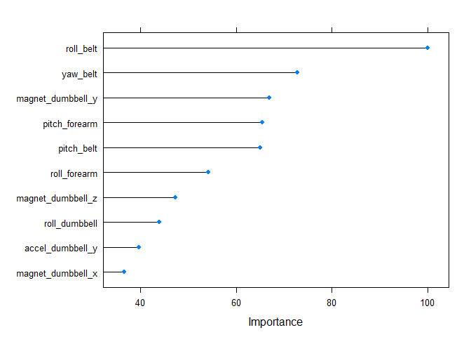

# Activity quality of Weight Lifting Exercises
Cheng  
Monday, February 09, 2015  

### Summary

===========================

This project aims to build a prediction model on common incorrect gestures during barbell lifts based on several variables collected by accelerometers. See more details on the project description [here](http://groupware.les.inf.puc-rio.br/har)(see the section on the Weight Lifting Exercise Dataset). As a result, we report a random forest model with a overall accuracy 0.9946 in the validation set and 100 % accuracy in the testing set. 


### Background

===========================

Using devices such as Jawbone Up, Nike FuelBand, and Fitbit it is now possible to collect a large amount of data about personal activity relatively inexpensively. In this project, we use data from accelerometers on the belt, forearm, arm, and dumbell of 6 participants. Six young health participants were asked to perform one set of 10 repetitions of the Unilateral Dumbbell Biceps Curl in five different fashions: exactly according to the specification (Class A), throwing the elbows to the front (Class B), lifting the dumbbell only halfway (Class C), lowering the dumbbell only halfway (Class D) and throwing the hips to the front (Class E). 


Read [more](http://groupware.les.inf.puc-rio.br/har#ixzz3RDCCaU6P)


### Feature Extraction & Selection

===========================

In this setion, we will load both the training and testing dataset downloaded [here](http://groupware.les.inf.puc-rio.br/static/WLE/WearableComputing_weight_lifting_exercises_biceps_curl_variations.csv). The `53` activity quality related features are extracted both in training (named as `build`) and testing dataset (named as `test`). Then we save 70% of `build` dataset as training set (named as `train`) and the remaining 30% as a validation (named as `val`) dataset. Finally we have three dataset: The `train` for model building. `val` data for out-of-sample error measurement and model selection. `test` for final model test. 


```r
# loading data
library(caret)

build <- read.csv("./pml-training.csv")
test <- read.csv("./pml-testing.csv")

dim(build)
dim(test)

# preprocessing
build[,7:159] <- sapply(build[,7:159],as.numeric) 
test[,7:159] <- sapply(test[,7:159], as.numeric) 


## feature extraction & selection

# select the activity features only
build <- build[8:160]
test <- test[8:160]

# since test set only contains 20 observations. 
# remove features that contains NAs in test set
nas <- is.na(apply(test,2,sum))

test <- test[,!nas]
build <- build[,!nas]

# create validation data set using Train 
inTrain <- createDataPartition(y=build$classe, p=0.7, list=FALSE)
train <- build[inTrain,]
val <- build[-inTrain,]
rm(inTrain,nas,build)
```

Here is a summary of the final datasets for model building after feature extraction. 

|Dataset | # of observations | # of features|
|--------|-------------------|--------------|
|training |13737|53|
|validation |5885|53|
|test| 20|53|

### Classification Model

===========================

In this setion, we proceed to testing some prediction models using the package caret and select one with the best out-of-sample error as our prediction model. 


we build random forest, boosting model and bagging for activity classfication. We compare the overall accuracy of two models and random forest mdoel shows better performance. 

Here shows a table of performance


|Method | Accuracy| Kappa | AccuracySD|KappaSD|
|------|---------|-------|-----------|-----------|
|Random Forest|0.9806360|0.9754981|0.002020839|0.002560955|
|Boosting|0.9593798|0.9486100|0.004351168|0.005487971|


#### Classification tree

In the first test, we use a regression tree with the method `rpart`. 


```r
library(rattle)
library(rpart.plot)
library(rpart)
##  regression tree model
# set.seed(123)
# Mod0 <- train(classe ~ .,data=train, method="rpart")
# save(Mod0,file="Mod0.RData")

load("Mod0.RData")
fancyRpartPlot(Mod0$finalModel)
```

 

```r
# out-of-sample errors of regression tree model using validation dataset 
pred0 <- predict(Mod0, val)
cm0 <- confusionMatrix(pred0, val$classe)
cm0$table
library(knitr)
# kable(cm0$table)
```

```
##           Reference
## Prediction    A    B    C    D    E
##          A 1076  224   32   56   14
##          B  175  604   51  139  254
##          C  311  259  804  501  266
##          D  110   52  139  268   67
##          E    2    0    0    0  481
```
    
The model (shows in the tree plot) preforms poorly with a overall acururacy 0.55. Specifically, it fails to indentify the class D (see confusion matrix above) and tends to asign most of cases to the class A. 


#### Random forest

Now, we run a random forest algorithm. `caret` use cross validation to select the number of the predictors. Here we use three fold cross validation in this model due the computational cost.   


```r
set.seed(123)

# random forest model
# system.time(Mod1 <- train(classe ~ ., method = "rf", 
#                data = train, importance = T, 
#                trControl = trainControl(method = "cv", number = 3)))
# save(Mod1,file="Mod1.RData")

load("Mod1.RData")
# Mod1$finalModel
vi <- varImp(Mod1)
vi$importance[1:10,]

# out-of-sample errors of random forest model using validation dataset 
pred1 <- predict(Mod1, val)
cm1 <- confusionMatrix(pred1, val$classe)

# summary of final model
# Mod1$finalModel
plot(Mod1)
```

 

```r
plot(Mod1$finalModel)
```

 

```r
plot(varImp(Mod1), top = 10)
```

 

```
##                          A         B         C         D          E
## roll_belt        82.759276 94.035593 91.012759 83.423775 100.000000
## pitch_belt       27.082772 94.968938 61.221630 49.343371  43.252939
## yaw_belt         74.404386 63.146457 70.748778 64.467045  50.757037
## total_accel_belt  3.709482  6.142350  5.024616  4.822766   2.436515
## gyros_belt_x     25.855751  9.453453 16.380724  8.033793  11.331922
## gyros_belt_y      2.049543 11.947830 12.322345  8.131822  13.845522
## gyros_belt_z     28.037973 29.452819 30.105131 21.025044  44.789433
## accel_belt_x      4.608242  6.947156  7.917366  1.365975   5.694481
## accel_belt_y      2.446740  8.595765  8.302915  8.522882   1.079211
## accel_belt_z     12.822200 22.184954 18.845292 16.853367  12.001318
```

The cross validation graph shows that the model with 27 predictors is selected by the best accuracy. The final model plot tells that the overall error converge at around 100 trees. So it is possible to speed up our algo by tuning the number of trees. The acururacy of the random forest model is 0.99. A list of top ten important variables in the model is given in the summary of the model. 

#### Boosting


```r
# boost fitting model
# system.time(Mod2 <- train(classe ~ ., 
#                   method = "gbm", 
#                   data = train, 
#                   verbose = F, 
#                   trControl = trainControl(method = "cv", number = 3)))
# save(Mod2,file="Mod2.RData")

load("Mod2.RData")

# out-of-sample errors using validation dataset 
pred2 <- predict(Mod2, val)
cm2 <- confusionMatrix(pred2, val$classe)
```


### Bagging


We plot out both specificity versus sensitivity for both random forest and boosting model.The figure shows random forest is better in both aspects. Therefore, in the final test, we will only use random forest.


```r
# compare the sensitivity and specificity btw random forest and boosting method

par(mfrow=c(1,2))
plot(cm1$byClass, main="random forest", xlim=c(0.97, 1.005))
text(cm1$byClass[,1]+0.003, cm1$byClass[,2], labels=LETTERS[1:5], cex= 0.7)
plot(cm2$byClass, main="boosting", xlim=c(0.93, 1.001))
text(cm2$byClass[,1]+0.005, cm2$byClass[,2], labels=LETTERS[1:5], cex= 0.7)
```

 


### Prediction and Output

===========================

In this setion, we use random forest model we built in last setion to predict the test data and output the result into text files.   


```r
test$classe <- as.character(predict(Mod1, test))

# write prediction files
pml_write_files = function(x){
        n = length(x)
        for(i in 1:n){
                filename = paste0("./predict/problem_id_", i, ".txt")
                write.table(x[i], file = filename, quote = FALSE, row.names = FALSE, col.names = FALSE)
        }
}
# pml_write_files(test$classe)
Mod1$finalModel
# summary(test$classe)
```

```
## 
## Call:
##  randomForest(x = x, y = y, mtry = param$mtry, importance = ..1) 
##                Type of random forest: classification
##                      Number of trees: 500
## No. of variables tried at each split: 27
## 
##         OOB estimate of  error rate: 0.64%
## Confusion matrix:
##      A    B    C    D    E class.error
## A 3901    3    0    0    2 0.001280082
## B   18 2633    6    1    0 0.009405568
## C    0   13 2376    7    0 0.008347245
## D    0    0   28 2223    1 0.012877442
## E    0    1    4    4 2516 0.003564356
```


